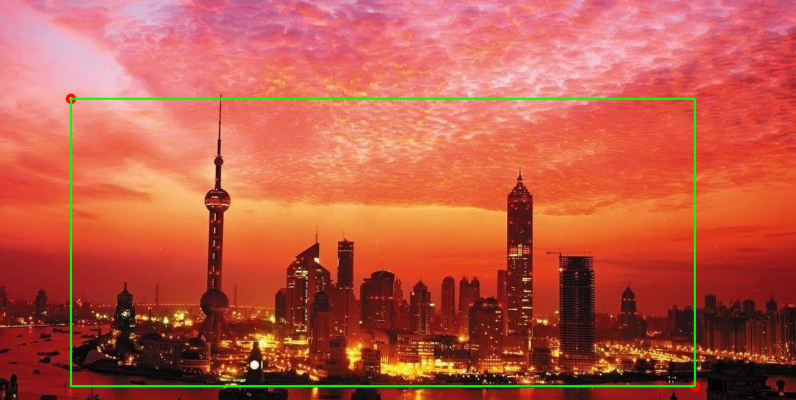
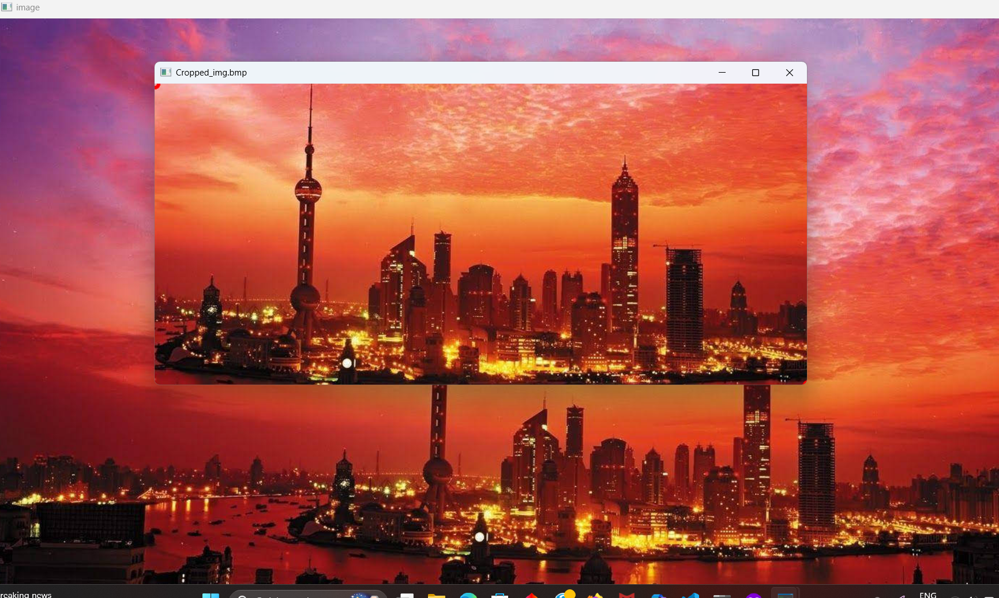

# image-cropping-opencv

Select two Points on the image (firstpoint-left & top),(second point-right & bottom) forming a rectangle shape

then the selected portion will be saved into saved_images by default the file name is cropped_image.bmp

